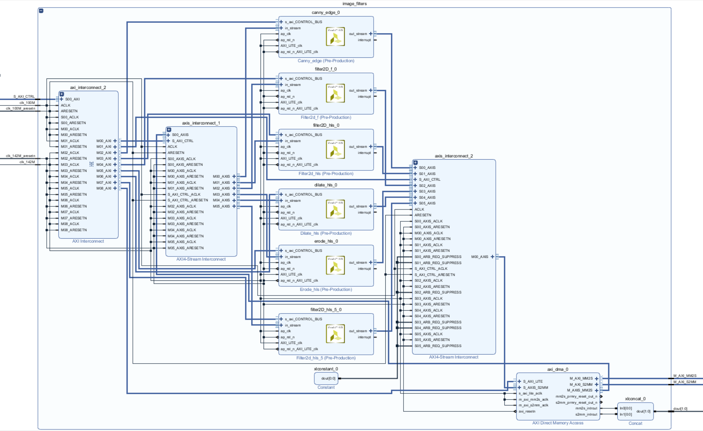

# cv2PYNQ - The project behind the library

Board used: Pynq-Z1

Vivado Version: 2017.4 

## Brief description:
This project accelerates [OpenCV](https://opencv.org/)-functions on the [PYNQ](http://www.pynq.io/) platform.
The library implements a specific set of popular image filters and feature detection algorithms.
The calculation of time-consuming tasks is implemented in the Programmable Logic (PL) of the ZYNQ chip.
All data are transferred through Direct Memory Access and streamed back to the DRAM and thus, the Python program.
cv2PYNQ also includes the Video-Subsystem of the [base](https://github.com/Xilinx/PYNQ) project of PYNQ.
Therefore, the HDMI In and Out interfaces can be used in your application.
The library calculates every filter for gray-channel images with 1080p within 16 ms if the input and output buffers
are located in the contiguous memory of the chip.   

Currently accelerated functions:
- Sobel: 3x3; 5x5
- Scharr
- Laplacian: ksize = 1; 3; 5
- blur: ksize = 3
- GaussinBlur: ksize = 3
- erode: ksize = 3
- dilate: ksize = 3
- Canny 

Link to YouTube Video:
https://www.youtube.com/watch?v=nRxe-NqvOl8

## Get Started
Install by typing: 
```
git clone https://github.com/wbrueckner/cv2pynq.git   
cd cv2pynq/   
pip3.6 install -e .   
``` 
into the terminal on your Pynq-Z1 board. 
The library comes with a jupyter notebook to demonstrate its usage and capabilities.
You find the notebook in the cv2PYNQ folder of your home tree after installation.

## Directory Structure

```
├── cv2pynq/                        *The python library as git submodule*    
├── cv2PYNQ_vivado/                 *The vivado project*
│   ├── cv2PYNQ.tcl
│   └── cv2PYNQ_vivado.xpr
├── doc/                            *Further documentaion*
│   └── PYNQ-OpenCV_xohw18-155.pdf
├── ip/                             *Used IP in this porject* 
│   ├── HLS/                        *HLS projects for image porcessing cores* 
│   │   ├── canny/
│   │   ├── dilate/
│   │   ├── erode/
│   │   ├── filter2D/
│   │   ├── filter2D_5/
│   │   └── filter2D_f/
│   └── PYNQ/                       *IP cores from the [base](https://github.com/Xilinx/PYNQ) project 
│       ├── ip/         
│       └── pynq_video_subsystem/
└── hw/                             *Bitstream and TCL-File*
```

## Contribute to cv2PYNQ

The library was build using ```Vivado 2017.4``` and ```Vivado HLS 2017.4```. 
It was designed with the need for expansion in mind, so we created a very adaptable architecture.
You can enhance the capabilities by adding image processing cores in the ```image_filters``` subsystem of the Vivado project.
Every image processing core is created with ```Vivado HLS```. 



- Clone the project and open the "cv2PYNQ_vivado.xpr" project file.
- Just take the ```filter2D``` project as a draft and exchange the ```hls::Filter2D```-function with the new functionality.
- Add the new IP to the IP Catalog of the Vivado project.
- Insert it into the ```image_filters``` sub-block and connect the IP like the others.
- Expand the number of interfaces in the AXI Interconnect and the two AXI-Stream Interconnects.
- Assign an address in the ```Address Editor```.
- Run the Implementation. Watch out for a Total Negative Slack (TNS) of >= 0ns. 
- Adapt the ```__init__.py``` and ```cv2pynq.py``` files with the added function in the library.
- Test the newly added functionality.
- Contribute to this project.